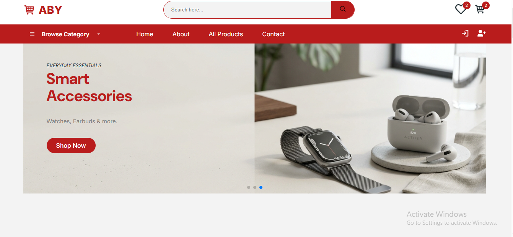
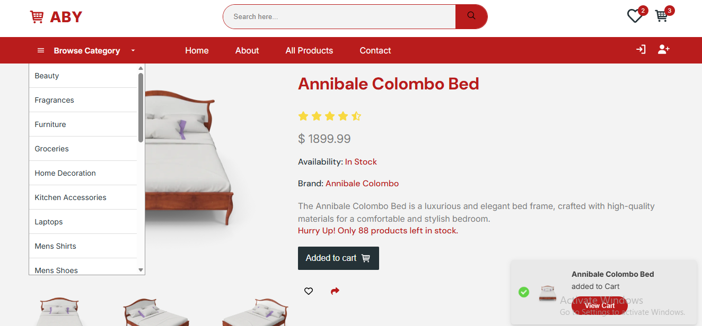
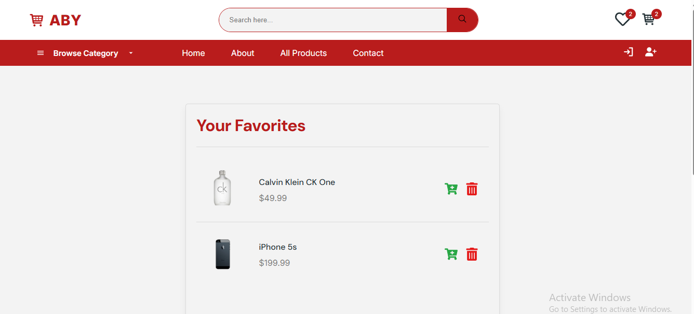
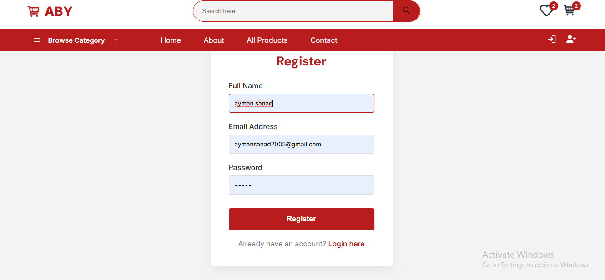
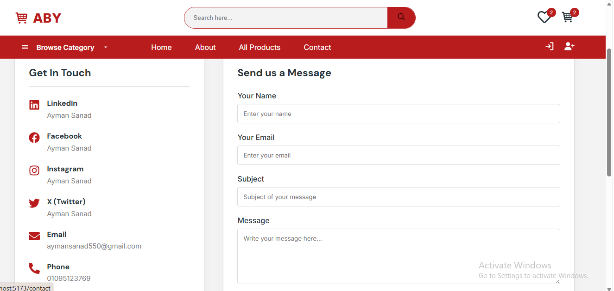
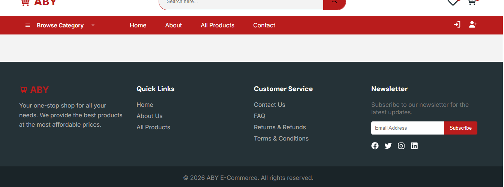

# 🛒 ABY E-Commerce

A modern e-commerce web application built with **React** and **Vite**, offering a smooth shopping experience — from browsing products to checkout.


---

## 📖 About the Project

ABY is a full front-end e-commerce platform that allows users to browse products, view product details, search and filter items, manage a shopping cart, create an account, and complete a checkout flow.

---

## ✨ Features

- 🏠 Home page with hero slider and featured products
- 🔍 Product search
- 🗂️ Browse all products / by category
- 📄 Detailed product page (images, price, description)
- 🛒 Shopping cart with quantity & total price management
- 🔐 User authentication (Login / Register)
- 💳 Checkout page
- 📩 Contact page
- 🦶 Footer with quick links & newsletter subscription

---

## 🛠️ Tech Stack

| Tool | Purpose |
|------|---------|
| React | UI Library |
| Vite | Build tool & dev server |
| React Router DOM | Client-side routing |
| Context API | Global state management (Cart, Auth) |
| CSS | Styling |

---

## 📁 Project Structure

```
src/
├── components/
│   ├── header/            # TopHeader, BtmHeader, header.css
│   ├── footer/             # Footer, footer.css
│   ├── slideProducts/      # Product, SlideProduct, SlideProductLoading
│   ├── context/            # CartContext, AuthContext
│   └── HeroSlider.jsx
├── page/
│   ├── Home/
│   ├── cart/
│   ├── productDetails/
│   ├── products/
│   ├── search/
│   ├── auth/                # Login, Register
│   ├── checkout/
│   └── contact/
├── img/
├── App.jsx
├── main.jsx
└── index.css
```

---

## 🚀 Getting Started

### Prerequisites
- Node.js (v18 or higher)
- npm

### Installation

```bash
# 1. Clone the repository
git clone https://github.com/<your-username>/<repo-name>.git

# 2. Navigate to the project folder
cd <repo-name>

# 3. Install dependencies
npm install

# 4. Run the development server
npm run dev
```

The app will be available at `http://localhost:5173`

---

## 👥 Team & Responsibilities

| Team Member | Responsibility |
|-------------|-----------------|
| **Ayman Ahmed Ahmed Ali Sanad** | Routing & entry point (`App.jsx`, `main.jsx`), Header, Hero Slider, Product cards, Home page, Contact page, global styling |
| **Yehia Mostafa Yehia** | Cart page, Product Details page, Cart state management (`CartContext`) |
| **Beshoy Nabil Shafik** | Footer, Authentication (Login/Register + `AuthContext`), Checkout page, All Products page, Search page |

---

## 🐞 Known Issues / TODO

- [ ] Final bug review across all components
- [ ] Responsive design check on mobile

---

## 📸 Screenshots

### Home Page


### Product Details


### Favorites


### Register


### Contact


### Footer


---

## 📄 License

This project is for educational purposes as part of an ITI React training project.
